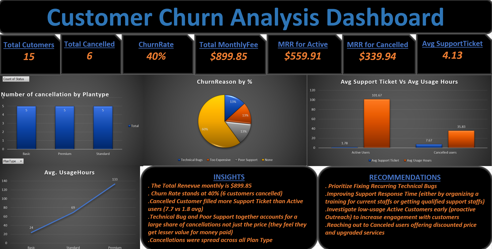

# Customer Churn Analysis

## Project Overview

This project analyzes customer churn for a subscription business using Microsoft Excel. The analysis explores churn rate, revenue impact, customer behavior, support activity, and stated cancellation reasons to identify the main factors associated with customer cancellations.

The project translates the analysis into practical recommendations aimed at reducing future churn and recovering lost recurring revenue.

## Business Problem

Subscription businesses can lose recurring revenue when customers cancel without a clear understanding of why they are leaving.

This analysis was designed to:

* Measure the customer churn rate and revenue at risk.
* Compare active and cancelled customers.
* Identify patterns across plan types and churn reasons.
* Examine customer support activity and usage behavior.
* Recommend actions that can help reduce future churn.

## Tools Used

* Microsoft Excel
* Power Query
* PivotTables
* PivotCharts
* Excel formulas
* Slicers
* Microsoft PowerPoint

## Methodology

The project followed a five-stage analytics workflow:

1. **Data Collection & Cleaning** — Consolidated customer records and standardized fields.
2. **Metric Calculation** — Calculated churn rate, monthly recurring revenue (MRR), support-ticket averages, and usage metrics.
3. **Visualization & Dashboarding** — Built an Excel dashboard using PivotTables, PivotCharts, and slicers.
4. **Insight Generation** — Examined churn reasons, plan types, support activity, and usage patterns.
5. **Reporting & Delivery** — Presented the findings through a dashboard and stakeholder-ready presentation.

## Dashboard Preview

## Key Findings

| Metric               |  Result |
| -------------------- | ------: |
| Total Customers      |      15 |
| Total Cancelled      |       6 |
| Churn Rate           |     40% |
| Total Monthly Fee    | $899.85 |
| MRR — Active         | $559.91 |
| MRR — Cancelled      | $339.94 |
| Avg. Support Tickets |    4.13 |

### Customer Behavior

* Cancelled customers filed an average of **7.67 support tickets**, compared with **1.78** for active users.
* Cancelled customers averaged **35.83 usage hours**, compared with **101.67** for active users.
* Usage increased from **24 hours on Basic** to **69 hours on Standard** and **133 hours on Premium**.
* Cancellations were spread across Basic, Standard, and Premium plans.

### Churn Reasons

The analysis found that **60% of cancellations were recorded without a specific reason**, highlighting a data-quality gap at the point of cancellation.

Technical Bugs, Too Expensive, and Poor Support were also recorded as cancellation reasons.

## Business Recommendations

### 1. Fix Recurring Technical Bugs

Prioritize engineering effort on technical issues frequently associated with cancellations and support requests.

### 2. Improve Support Response Time

Strengthen support capacity and response processes to reduce the service friction experienced by customers who are at risk of cancelling.

### 3. Proactively Monitor Low-Usage Customers

Identify customers showing declining or consistently low engagement and contact them before they reach the point of cancellation.

### 4. Win Back Cancelled Customers

Develop targeted win-back offers for cancelled customers, particularly those who cited support or technical issues.

## Project Files

* [Excel Dashboard](dashboard/Customer-Churn-Analysis-Dashboard.xlsx)
* [Dashboard Preview](dashboard/Dashboard.png)
* [PowerPoint Presentation](presentation/customer-churn-analysis-presentation.pptx)

## Author

**Afolabi S. Adedeji**

Data Analytics Portfolio Project
